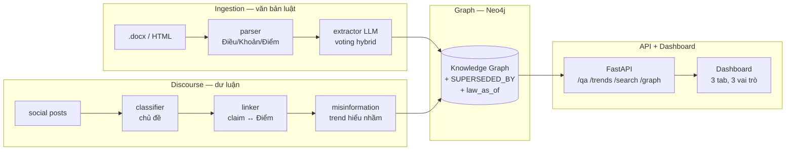

# LAWGIC — Legal Analytics With Graph-Integrated Cognition

**Legal Knowledge Graph** nối hai luồng dữ liệu — **văn bản pháp luật** và **thảo luận công khai** — trên một Neo4j duy nhất, để **phát hiện sớm hiểu nhầm chính sách** đang lan trong dư luận và **trả lời câu hỏi pháp lý có trích dẫn Điều — Khoản — Điểm**.

Khác với RAG vector thuần, LAWGIC lưu quan hệ `SUPERSEDED_BY` ở **mức Điểm**, cho phép truy vấn *"luật nói gì tại ngày X"* và *"điều này đã bị sửa như thế nào"* — điều mà một vector store không làm được.

<p>
  
  
  
  
</p>

---

## Mục lục

1. [Giới thiệu](#1-giới-thiệu)
2. [Ảnh demo](#2-ảnh-demo)
3. [Điểm khác biệt cốt lõi](#3-điểm-khác-biệt-cốt-lõi)
4. [Kiến trúc hệ thống](#4-kiến-trúc-hệ-thống)
5. [Pipeline dữ liệu](#5-pipeline-dữ-liệu)
6. [Cấu trúc thư mục](#6-cấu-trúc-thư-mục)
7. [Cài đặt và chạy](#7-cài-đặt-và-chạy)
8. [Tài liệu API](#8-tài-liệu-api)
9. [Quy trình benchmark và đánh giá](#9-quy-trình-benchmark-và-đánh-giá)
10. [Dữ liệu demo](#10-dữ-liệu-demo)
11. [Hướng phát triển](#11-hướng-phát-triển)
12. [Nhóm thực hiện](#12-nhóm-thực-hiện)
13. [Social](#13-social)
14. [Giấy phép](#14-giấy-phép)

---

## 1. Giới thiệu

Khi một luật thuế mới có hiệu lực, dư luận thường nhớ nhầm quy định cũ và lan truyền thông tin sai. LAWGIC giải quyết bài toán này bằng ba năng lực đặt trên **một đồ thị tri thức pháp lý**:

- **Cảnh báo hiểu nhầm** — gom bình luận công khai thành các "trend" hiểu sai, đối chiếu với điều luật thật và đưa ra định chính.
- **Hỏi — Đáp có trích dẫn** — mọi câu trả lời bắt buộc kèm citation Điều — Khoản — Điểm; không tìm được căn cứ trong graph thì **từ chối trả lời, không đoán**.
- **Tra cứu văn bản** — tìm Điều — Khoản — Điểm theo từ khóa trực tiếp trên full-text index của graph, kèm trạng thái hiệu lực theo thời gian.

Mỗi quyết định kỹ thuật (chọn model trích xuất, cách hợp phiếu, phương pháp đo) đều **có số liệu benchmark trên gold set gán tay** — xem [phần 9](#9-quy-trình-benchmark-và-đánh-giá).

---

## 2. Ảnh demo

**Hỏi — Đáp có trích dẫn** — câu trả lời kèm citation Điều — Khoản — Điểm và đồ thị quan hệ điều luật tương tác (nhấn node để đọc, nhấn cạnh để xem quan hệ, "Mở rộng" để bung thêm):


**Tra cứu văn bản** — full-text search trên graph, tô sáng từ khóa, hiển thị trạng thái hiệu lực (đang hiệu lực / hết hiệu lực) và mốc thời gian của từng Điều — Khoản:


---

## 3. Điểm khác biệt cốt lõi

| | Đặc điểm | Vì sao quan trọng |
|---|---|---|
| **Graph database thật** | Node Điều / Khoản / Điểm + quan hệ, không phải kho vector | Quan hệ `SUPERSEDED_BY` ở **mức Điểm** trả lời được *"luật nói gì tại ngày X"* — vector thuần bó tay |
| **Version tracking theo thời gian** | Semantic diffing tự phát hiện văn bản mới sửa văn bản cũ | Truy vấn `law_as_of(date)` cho phép "time-travel" trong lịch sử điều luật |
| **Citation bắt buộc, chống bịa 2 lớp** | Prompt ràng buộc + API validate lại `node_id` có thật | Citation không khớp bị loại; hết citation thì từ chối trả lời — không tin LLM |
| **Retrieval hybrid** | Embedding ngữ nghĩa + TF-IDF từ vựng + mở rộng theo graph | Bắc cầu được *"200 triệu"* ↔ *"500 triệu"* và luật cũ ↔ luật mới |
| **Có đo lường minh bạch** | Gold set gán tay, P/R/F1 theo trường, nêu thẳng hạn chế | Con số thay cho "chúng em làm xong"; đội tự nêu điểm yếu của mình |

---

## 4. Kiến trúc hệ thống



Bốn workstream được phát triển song song trên hai **contract đóng băng từ giờ đầu** — `backend/models/schemas.py` (contract dữ liệu) và `backend/graph/schema.py` (contract graph) — cho phép 4 người code độc lập mà không giẫm chân. Chi tiết phân công: [DIVISION.md](DIVISION.md).

---

## 5. Pipeline dữ liệu

```
Văn bản luật ──> parser ──> extractor ──┐
 (P1)            Điều/Khoản/Điểm  (LLM)  │
                                         ├──> Neo4j ──> API ──> Dashboard
Bình luận ────> classifier ──> linker ──┘     (P2)      (P4)      (P4)
 (P3)           chủ đề        claim↔Điểm
                             │
                             └──> misinformation ──> cảnh báo trend
```

- **P1 — Ingestion**: regex + máy trạng thái tách Điều — Khoản — Điểm (tất định), rồi LLM trích 10 nhóm thực thể (chủ thể, nghĩa vụ, quyền, cấm, chế tài, thời hạn, tham chiếu, thuế suất, cơ sở tính thuế, miễn giảm).
- **P2 — Graph**: `loader.py` nạp node/cạnh; `diffing.py` dựng `SUPERSEDED_BY` ở mức Điểm; `law_as_of(date)` cho truy vấn theo thời gian.
- **P3 — Discourse**: phân loại bình luận theo luồng, liên kết claim ↔ điều luật (retrieval hybrid + mở rộng graph), gom trend hiểu nhầm.
- **P4 — API + Dashboard**: Q&A có citation, dashboard 3 tab với 3 vai trò (Khách / Người dùng / Quản trị).

---

## 6. Cấu trúc thư mục

| Thư mục | Nội dung | Workstream |
|---|---|---|
| `backend/models/schemas.py` | **Contract dữ liệu chung** — mọi module trao đổi qua đây | Cả nhóm |
| `backend/graph/schema.py` | **Contract graph** — node / relationship Neo4j | Cả nhóm |
| `backend/core/` | Config + LLM client dùng chung (FPT AI Marketplace, tương thích OpenAI SDK) | P4 |
| `backend/ingestion/` | Parser Điều — Khoản — Điểm, trích entity | P1 |
| `backend/graph/` | Loader, semantic diffing, truy vấn theo thời gian | P2 |
| `backend/discourse/` | Phân loại chủ đề, linker claim ↔ điều luật, phát hiện trend, embeddings | P3 |
| `backend/api/` | Q&A API (có citation) + API dashboard + rate limit | P4 |
| `frontend/static/` | Dashboard sidebar + 3 tab, không build step (HTML + JS thuần) | P4 |
| `eval/` | Benchmark parser/extractor + đánh giá Q&A + gold set | P1, P3 |
| `prompts/` | Prompt LLM dùng trong pipeline | P1, P3 |
| `scripts/` | Crawl, dựng lại pipeline, tra cứu tiện ích | Cả nhóm |
| `tests/` | 107 test tự động (parser, graph, linker, discourse, eval, retry) | Cả nhóm |
| `demo/` | Kịch bản demo + query Neo4j đã dán màu | P4 |

---

## 7. Cài đặt và chạy

**Yêu cầu**: Docker + Docker Compose. (Chạy thủ công cần Python 3.11+ và một Neo4j 5.25.)

```bash
# 1. Cấu hình: điền LLM_API_KEY (FPT AI Marketplace) + Neo4j password
cp .env.example .env

# 2. Dựng cả stack — Neo4j + API bằng một lệnh
docker compose up

# 3. Nạp graph một lần (chạy trong container api)
docker compose exec api python -m backend.graph.loader --wipe

# 4. Mở dashboard
open http://localhost:8000/
```

| Dịch vụ | Địa chỉ | Ghi chú |
|---|---|---|
| **Dashboard** | http://localhost:8000/ | 3 tab: Cảnh báo hiểu nhầm · Hỏi — Đáp có citation · Tra cứu văn bản |
| **API docs (Swagger)** | http://localhost:8000/docs | Tự sinh từ FastAPI |
| **Neo4j Browser** | http://localhost:7474 | Dán `demo/graph_legend.md` để tô màu graph |

Dữ liệu đã xử lý (`data/processed/`, `data/raw/social_posts.json`) **đã được commit** — không cần chạy lại parser/extractor. Muốn dựng lại từ đầu: xem `scripts/`.

**Đăng nhập dashboard** (fake auth client-side cho demo): email chứa `admin` → vai trò **Quản trị**; email khác → **Người dùng**; không đăng nhập → **Khách** (giới hạn 5 câu Q&A/phiên). Backend còn có rate limit thật: 10 câu Q&A + 30 lượt tra cứu/phút/IP (`backend/api/ratelimit.py`).

**Đổi nhà cung cấp LLM**: chỉ cần đổi `LLM_BASE_URL` / `LLM_API_KEY` / `LLM_MODEL` trong `.env`, không đụng vào code (`backend/core/llm.py`).

---

## 8. Tài liệu API

| Method | Endpoint | Chức năng |
|---|---|---|
| `POST` | `/qa` | Hỏi — đáp có citation Điều — Khoản — Điểm (tùy chọn `as_of_date`) |
| `GET` | `/trends` | Danh sách trend hiểu nhầm đang hoạt động |
| `GET` | `/misconception/{misc_id}` | Chi tiết một hiểu nhầm + điều luật định chính + post minh họa |
| `GET` | `/search` | Full-text search Điều — Khoản — Điểm trên graph |
| `GET` | `/graph/subgraph` | Trích subgraph quanh một node để vẽ đồ thị quan hệ |
| `GET` | `/law/article` | Đọc nguyên văn một Điều |
| `GET` | `/documents`, `/documents/{doc_id}` | Danh sách / chi tiết văn bản |
| `GET` | `/document/{doc_id}/diff` | So sánh phiên bản cũ ↔ mới (SUPERSEDED_BY) |
| `GET` | `/stats`, `/health` | Thống kê hệ thống + kiểm tra nguồn dữ liệu |

**Chống bịa đặt trong `/qa` (2 lớp):**
1. Prompt yêu cầu LLM **chỉ** dùng điều luật có trong context và trả về `node_id`.
2. API **validate lại** mọi `node_id` với node có thật trong graph; citation không khớp bị loại. Sau khi lọc mà không còn citation nào → **từ chối trả lời**.

Khi thiếu `LLM_API_KEY` hoặc LLM lỗi → fallback template liệt kê nguyên văn điều luật retrieve được, **vẫn có citation thật**.

---

## 9. Quy trình benchmark và đánh giá

Toàn bộ quá trình đo được ghi chép chi tiết trong [`benchmark.md`](benchmark.md). Nguyên tắc xuyên suốt: **mỗi quyết định phải có số đo trên gold set gán tay**, và **nêu thẳng hạn chế** thay vì tô hồng.

### 9.1 Vì sao đo hai thành phần P1 theo hai cách khác nhau

Parser và Extractor **khác bản chất** nên không thể dùng chung một metric:

| | Parser | Extractor |
|---|---|---|
| Công cụ | Regex + máy trạng thái | LLM (voting `gpt-oss-20b` ∩ `gemma-31B`) |
| Tất định? | Có — chạy 100 lần ra y hệt | Không — mỗi lần có thể khác |
| Có "đáp án đúng"? | Có — văn bản tự khai số Điều | Không — phải người gán nhãn |
| Đo bằng | Đối chiếu tự động (0 người) | Gold set gán tay (P/R/F1) |

Dùng *accuracy* cho extractor là **sai** — output là *tập hợp* span tự do, không phải nhãn đơn, nên đo bằng **Precision / Recall / F1**.

### 9.2 Parser — ground truth khách quan

| Văn bản | Node | Article recall | Lỗi bất biến |
|---|---:|---:|---:|
| `qlt2019` | 1.194 | 100% | 0 |
| `qlt2025` | 662 | 100% | 0 |
| `tncn2025` | 199 | 100% | 0 |
| **Tổng** | **2.055** | **100%** (234/234 Điều) | **0** |

Character coverage ≥ 98%, 0 `node_id` trùng, 7 bất biến `validate()` đều 0 lỗi. Văn bản QPPL Việt Nam có cấu trúc cứng (Nghị định 30/2020), số Điều đếm được — nên "đúng" ở đây là **tuyệt đối**, không phải xấp xỉ.

### 9.3 Extractor — so sánh 4 model (100 node gold / 235 span)

Cùng gold, cùng prompt EN, cùng cách gộp node → tách được ảnh hưởng của **model**. Sắp theo F1 giảm dần:

| Model | Nhà / cỡ | F1 | P | R | Hallucination | Penalty-type |
|---|---|---:|---:|---:|---:|---:|
| **gemma-4-31B-it** | Google / 31B | **80%** | 70% | **93%** | 30% | **0%** |
| gpt-oss-20b | OpenAI / 20B | 77% | 68% | 90% | 32% | **71%** |
| SaoLa3.1-medium | Việt Nam | 67% | 63% | 71% | 37% | 43% |
| Llama-3.3-70B | Meta / 70B | 64% | 63% | 64% | 37% | 29% |

**Ba giả định bị dữ liệu bác bỏ:**
- *To hơn thì tốt hơn* — **sai**: Llama-70B rơi đáy (F1 64%).
- *Model tiếng Việt thì thắng* — **sai**: SaoLa chỉ 67%. Nút thắt là **kỷ luật làm theo lệnh + trích có cấu trúc**, không phải đọc hiểu tiếng Việt.
- *Prompt tốt + kỷ luật hơn kích thước* — **đúng**.

**Bài học lớn nhất — bảng xếp hạng LẬT khi tăng gold từ 36 → 100 node.** Ở 36 node (khoảng tin cậy ±9%) Llama-70B đứng nhì nên *đã bị chọn chạy full*; ở 100 node (±6%) nó rơi xuống đáy. Mẫu nhỏ khiến thứ hạng nhiễu — chính benchmark đã tự bắt được lỗi chọn nhầm của nhóm.

### 9.4 Hợp phiếu đa model — giảm hallucination mà giữ recall

Câu hỏi: kết hợp 2 model có **giảm bịa mà không mất recall** không?

| Cấu hình | F1 | P | R | Hallucination | Penalty-type |
|---|---:|---:|---:|---:|---:|
| gpt-oss-20b đơn | 78% | 68% | 92% | 32% | 71% |
| gemma-31B đơn | 81% | 72% | 93% | 28% | 0% |
| A∩B (giao / voting) | **84%** | **80%** | 89% | **20%** | 0% |
| A∪B (hợp) | 75% | 61% | **98%** | 39% | 71% |
| **A∩B thực thể + penalty của 20b** | **84%** | **80%** | **89%** | **20%** | **71%** |

Ba kết luận đo được:
1. **Voting không tụt recall như lo ngại** — giao A∩B chỉ mất 3% recall (92→89) mà precision +12 (68→80), hallucination giảm gần nửa (32→20). Hai model vốn recall cao nên span đúng thường *cả hai cùng thấy*.
2. **Lọc verbatim vô dụng ở đây** — `A∪B` và `A∪B + lọc` giống hệt nhau. Nghĩa là hallucination **không phải bịa chữ** mà là **sai vai** (gán đúng chữ, nhầm chủ thể/nghĩa vụ). Grounding không cắt được — **voting mới là đòn bẩy**.
3. **Phép giao triệt tiêu penalty-type** (gemma 0%), nên cấu hình chốt: giao 9 trường thực thể **nhưng giữ penalty của 20b** → đạt cả F1 84% lẫn penalty-type 71%.

### 9.5 Extractor triển khai thật (voting hybrid trên 1.842 node)

Số của file graph **nạp thật**, đo lại trên cùng 100 node gold:

| Metric | Kết quả | So với 20b đơn |
|---|---:|---|
| **Micro F1** | **81%** | +4 (77→81) |
| **Macro F1** | **76%** | +6 (70→76) |
| **Precision** | **83%** | **+15** (68→83) |
| **Recall** | **79%** | −11 (90→79) \* |
| **Hallucination rate** | **17%** | giảm gần nửa (32→17) |
| **Empty-correct rate** | **92%** | +25 (67→92) |
| **Penalty-type accuracy** | **71%** | giữ (71) |

\* Recall 79% thấp hơn mức test sạch 89% vì bản 20b chạy full 1.842 node **bị FPT rate-limit**, nhiều node trả rỗng phải retry — đầu vào yếu hơn nên phép giao kéo recall xuống. Nêu thẳng, không giấu; chạy lại khi rate-limit rảnh sẽ về ~89%.

### 9.6 Linker (P3) — retrieval claim ↔ điều luật

| Cấu hình retrieval | Recall trên gold |
|---|---:|
| TF-IDF từ vựng một mình | 63% |
| **Hybrid (embedding ngữ nghĩa + TF-IDF + mở rộng graph)** | **86%** |

Embedding bắc được cầu ngữ nghĩa (*"200 triệu"* ↔ *"500 triệu"*), còn bước mở rộng graph đi `SUPERSEDED_BY` cả hai chiều để chạm được Điểm ở luật mới — chỗ vector thuần bó tay. Khi embedding lỗi/không có key, pipeline **tự lùi về TF-IDF**, không gãy.

### 9.7 Q&A — đánh giá kiểu RAGAS không phụ thuộc RAGAS

Gold Q&A: **50 câu** gán tay (`eval/qa_gold.jsonl`), gồm câu trả được và câu lạc đề. Đo bằng hai cách bổ sung nhau:

- **Exact-match** (`eval/qa_eval.py`) — gọi thẳng handler `/qa`, không qua HTTP:
  - `citation_accuracy` — `expected_citation` có trong danh sách citation trả về (tương đương context recall).
  - `answer_correctness` — tỷ lệ con số/đơn vị trong ground_truth xuất hiện trong câu trả lời (proxy khách quan, không cần LLM-judge).
  - `answerable_answered` / `offtopic_refused` — câu trả được **không** bị từ chối oan; câu lạc đề **phải** bị từ chối.
  - `faithfulness` — mọi citation là node **thật** (endpoint đã validate → ~100%).
- **Semantic** (`eval/qa_semantic_eval.py`) — tính thẳng các chiều RAGAS bằng cosine trên FPT `Vietnamese_Embedding` (so nghĩa, không so chữ): answer similarity / relevancy / context recall / faithfulness.
- **RAGAS thật** (`eval/ragas_eval.py`) — chạy trong venv riêng, chỉ dùng để **đối chiếu tương đối** (RAGAS-judge chạy trên model nhỏ nên không tuyệt đối).

> Vì sao không chỉ dùng package RAGAS: RAGAS 0.2/0.4 xung đột langchain 1.x trong môi trường này, và RAGAS-judge chạy `gpt-oss-20b` (model nhỏ) làm judge kém tin cậy. Nên nhóm tính thẳng metric semantic bằng embedding — đúng tinh thần RAGAS mà đáng tin hơn.

### 9.8 Cách chọn metric và ngưỡng khớp

- **P/R/F1 theo trường** thay vì accuracy — entity extraction là so khớp *tập hợp*.
- **Micro + Macro** — micro nghiêng về trường nhiều dữ liệu; macro cho trường ít node (prohibitions, exemptions) tiếng nói ngang.
- **Hallucination rate** — quan trọng nhất với văn bản luật: bịa/sai vai còn tệ hơn bỏ sót.
- **Empty-correct rate** — chống LLM "lười" nặn bừa cho đủ trường ở node định nghĩa.
- **Penalty-type accuracy** — chống dồn hết chế tài vào `OTHER`.
- **Ngưỡng khớp span** = 0.60 (SequenceMatcher) + luật "chứa nhau thì khớp" — ghi rõ để tái lập.

### 9.9 Bộ test tự động

**107 test** trên 8 file, phủ toàn pipeline:

```bash
pytest -q
```

| File | Test | Phủ |
|---|---:|---|
| `tests/test_graph.py` | 23 | Loader, diffing, truy vấn thời gian |
| `tests/test_parser.py` | 21 | Parser Điều — Khoản — Điểm, bất biến |
| `tests/test_discourse.py` | 14 | Classifier, phân loại luồng |
| `tests/test_misinformation.py` | 12 | Gom trend hiểu nhầm |
| `tests/test_gold_worksheet.py` | 12 | Tính toàn vẹn gold set |
| `tests/test_linker.py` | 10 | Retrieval hybrid + mở rộng graph |
| `tests/test_llm_retry.py` | 8 | Retry LLM khi rate-limit |
| `tests/test_eval.py` | 7 | Logic chấm điểm |

### 9.10 Hạn chế (nêu thẳng)

1. **Gold một người gán** — chưa đo được inter-annotator agreement (chuẩn hơn cần ≥2 người + Cohen's kappa). Bù lại: gold **kiểm 4 vòng** đối chiếu văn bản gốc.
2. **100 node = 4,9% tổng** → khoảng tin cậy ±6%. Đủ để thứ hạng model ổn định (chính mẫu 100 node đã lật bảng).
3. **`exemptions` yếu nhất (F1 31%)** — miễn/giảm/ngưỡng trong luật thuế diễn đạt rất đa dạng, ranh giới với `rights` mờ; một phần là **bản chất nhập nhằng** của luật, không phương pháp tự động nào chạm 100%.
4. Kiến trúc đã phòng điều này: **text parse 100% + citation nguyên văn** là nguồn sự thật, extraction chỉ là lớp metadata để tìm kiếm. Extractor sai chỉ lệch *tìm kiếm*, không làm hỏng *nội dung luật* trả cho người dùng.

---

## 10. Dữ liệu demo

**Ba văn bản thuế:**
- Luật Quản lý thuế **38/2019/QH14** (cũ, một phần bị thay thế)
- Luật Quản lý thuế sửa đổi **108/2025/QH15**
- Luật Thuế thu nhập cá nhân sửa đổi **109/2025/QH15**

Hai luật mới có hiệu lực **01/07/2026**. Case demo chính: ngưỡng miễn TNCN **500 triệu/năm** cho hộ kinh doanh — trong khi dư luận nhớ nhầm ngưỡng ~100–200 triệu theo quy định khoán cũ.

**Dư luận:** 3.321 bình luận công khai lấy trên VnExpress (04/06/2025 – 10/04/2026), gấp 6,6× mục tiêu 500 post. Tác giả được **hash**, không lưu danh tính; HTML và `@mention` đã được loại bỏ.

**Gold set:** 100 node / 235 span cho extractor, 75 dòng gold cho linker, 50 câu cho Q&A — tất cả trong `eval/`.

---

## 11. Hướng phát triển

Các hướng đã **ghi chép và đo trước** trong [`crawl_docs.md`](crawl_docs.md) §7 và [`P3_PLAN.md`](P3_PLAN.md), xếp theo giá trị:

**Ưu tiên cao**
- **Neo cửa sổ trend vào mốc thời gian truyền vào** (giống `law_as_of(date)`) — demo được *"tại 15/12/2025, tin đồn X đang lan mạnh"*, hợp với chủ đề time-travel của cả dự án.
- **Gửi cả luồng thảo luận cho LLM** thay vì từng post lẻ — giảm 47% token **và** giữ ngữ cảnh, bắt được cả các đính chính (reply "Rất chính xác" chỉ có nghĩa khi kèm post gốc). Ưu tiên 314 luồng có tranh luận (22% số luồng nhưng chứa toàn bộ reply).
- **Chạy lại extractor 20b full khi rate-limit rảnh** để đưa recall graph từ 79% về ~89%.

**Nâng chất lượng**
- **Embedding chuyên biệt (sentence-transformers)** thay TF-IDF trong linker để nâng recall vượt 86%.
- **Nhiều người gán gold độc lập + Cohen's kappa** để có inter-annotator agreement.
- **Prompt và gold riêng cho `exemptions`** — trường yếu nhất hiện tại.
- **Bổ sung test cho crawler** — món nợ kỹ thuật đã ghi nhận.

**Mở rộng phạm vi**
- **Thêm nguồn dư luận**: Tuổi Trẻ, Dân Trí, VietnamNet (`platform` đã sẵn sàng trong schema).
- **Mở rộng bộ văn bản** sang các lĩnh vực luật khác — kiến trúc graph không phụ thuộc miền thuế.

---

## 12. Nhóm thực hiện

Dự án được 4 thành viên phát triển song song theo mô hình **contract-first** (đóng băng schema từ giờ đầu để code độc lập). Trách nhiệm chính:

| Thành viên | Mảng phụ trách chính |
|---|---|
| **Vũ Hoàng Diệu Linh** | Graph & version-tracking (P2) — Neo4j loader, semantic diffing `SUPERSEDED_BY`, truy vấn theo thời gian |
| **Lê Hoàng Quân** | Ingestion & benchmark (P1) — parser Điều — Khoản — Điểm, extractor, hợp phiếu đa model, crawl dữ liệu |
| **Nguyễn Thị Hiền** | Discourse & đánh giá (P3) — classifier, linker, phát hiện trend hiểu nhầm, gold set + eval |
| **Dương Trọng Nguyên** | LLM core, API & dashboard (P4) — `core/llm.py`, FastAPI, Q&A có citation, frontend, kịch bản demo |

> Do làm việc trên contract chung, nhiều phần có sự phối hợp và hỗ trợ chéo giữa các thành viên (xem [DIVISION.md](DIVISION.md) và nhật ký bàn giao trong các file `*.md`).

---

## 13. Social

<!-- Để trống — bổ sung sau -->

---

## 14. Giấy phép

Dự án phục vụ mục đích học thuật và trình diễn tại VAIC 2026. Dữ liệu bình luận lấy từ API công khai của VnExpress, tác giả đã được ẩn danh (hash), tuân thủ độ trễ request lịch sự với máy chủ.
