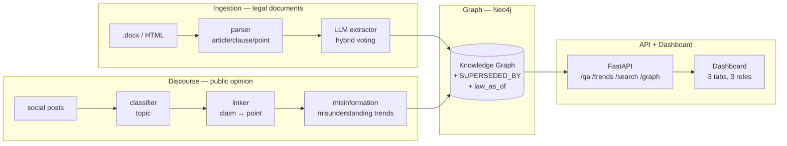
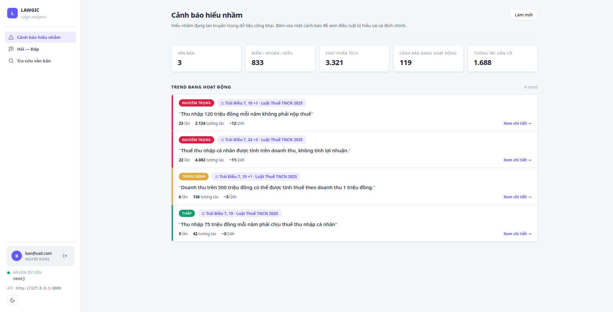
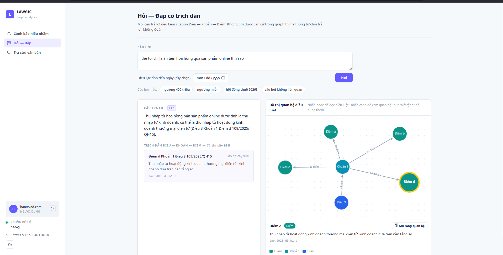
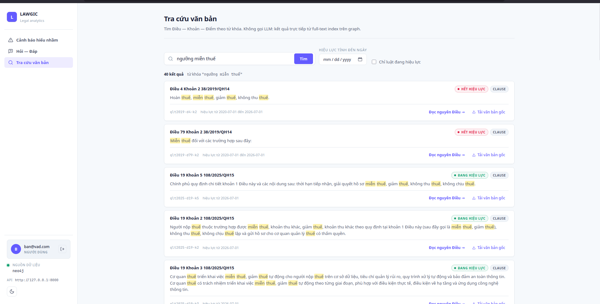

<div align="center">

  

  # LAWGIC - Legal Analytics With Graph-Integrated Cognition

  **A Legal Knowledge Graph that links legal documents and public discourse on a single Neo4j instance — structuring law at the article–clause–point level, tracking amendments over time, and answering legal questions with mandatory source citations while detecting policy misunderstandings spreading on social media.**

  
  
  
  
  [](https://github.com/dlxik/LAWGIC--L-GPT6.7--VAIC2026/actions/workflows/ci.yml)

  [](https://github.com/dlxik/LAWGIC--L-GPT6.7--VAIC2026)
</div>

---

## Table of Contents

- [1. Overview & Requirements Coverage](#1-overview--requirements-coverage)
- [2. Data](#2-data)
- [3. Model & Architecture](#3-model--architecture)
- [4. Evaluation](#4-evaluation)
- [5. Deployment & Demo](#5-deployment--demo)
- [6. Limitations & Future Work](#6-limitations--future-work)
- [7. Impact & Applications](#7-impact--applications)
- [8. Authors & License](#8-authors--license)

---

## 1. Overview & Requirements Coverage

Project built for **Vietnam AI Innovation Challenge (VAIC) 2026**.

### Context & problem
From **July 1, 2026**, many new laws, decrees, and circulars take effect. This creates strong demand for quickly understanding legal impact, updating compliance processes, and explaining policy to citizens and businesses. At the same time, social media generates a surge of discussion, questions, and reactions — many carrying **misunderstandings** about the new rules.

Traditional legal-information tools fail here in three ways:
- **Policy misunderstanding** — the public misremembers old rules and spreads incorrect information.
- **Ungrounded answers** — plain vector-RAG chatbots **hallucinate** or answer vaguely, unable to cite the exact article–clause–point.
- **No temporal awareness** — a vector store cannot store the relation "a new document amends an older one", so it cannot answer *"what did the law say on date X?"*.

### Solution
LAWGIC addresses the full task on **one legal knowledge graph** (Neo4j) with three capabilities:

1. **Misinformation Detection** — cluster public comments into misunderstanding "trends", cross-check them against the real legal provision, and issue a correction. Each alert is **ranked by communications-risk severity** (high / medium / low) and **cites the exact article it contradicts** (Điều–Khoản–Điểm), so a comms team sees at a glance which rumor to correct first and on what legal basis.
2. **Citation-grounded Q&A** — every answer must carry an article–clause–point citation; if no basis is found in the graph, it **refuses to answer rather than guessing**. Two-layer anti-hallucination: prompt constraints + API re-validates that each `node_id` truly exists.
3. **Time-aware Search** — full-text search over articles/clauses/points on the graph, with effectivity status over time via the `SUPERSEDED_BY` relation (at the **point level**) and the `law_as_of(date)` query.

### Requirements coverage (task compliance matrix)

Every requirement in the brief is implemented and backed by measured evidence.

| # | Task requirement | Evidence / metric |
|---|---|---|
| 1 | **Collect & structure legal documents at article–clause–point level** | **2,055 nodes**, **100% article recall** (234/234), 0 invariant errors |
| 2 | **Extract subjects, obligations, rights, prohibited acts, deadlines, penalties & related documents** | **10 entity groups**, micro-F1 **84%** (A∩B voting) |
| 3 | **Monitor public social-media discussion by legal topic** | **3,321 comments** classified by legal topic |
| 4 | **Extract updates & changes vs prior circulars/decrees on the same issue** | Point-level version tracking (`SUPERSEDED_BY` + `law_as_of`) |
| 5 | **Link posts / topics / claims to the corresponding legal provisions** | Hybrid linker, recall **86%** (vs 63% TF-IDF-only) |
| 6 | **Detect trends, misunderstandings, misinformation & communications risk** | Trend clustering + **severity ranking (comms-risk level)** + correction citing the exact violated article |
| 7 | **Provide a dashboard or Q&A API with source citations** | **Both**: 3-tab dashboard **and** `/qa` API, every answer cited |

> **Design principle:** every technical decision (extraction model, vote-combining, evaluation method) is backed by **numbers on a hand-labeled gold set**, and limitations are stated openly rather than glossed over — see [§4](#4-evaluation).

### Directory structure
```
LAWGIC--L-GPT6.7--VAIC2026/
├── backend/
│  ├── models/schemas.py      # Shared data contract — every module exchanges through it
│  ├── graph/schema.py        # Graph contract — Neo4j nodes / relationships
│  ├── core/                  # Shared config + LLM client (OpenAI-SDK compatible)
│  ├── ingestion/             # Article–clause–point parser + entity extractor (Req. 1, 2)
│  ├── graph/                 # Loader, semantic diffing, time-travel queries (Req. 4)
│  ├── discourse/             # Topic classifier, claim↔law linker, trends, embeddings (Req. 3, 5, 6)
│  ├── api/                   # Q&A API (cited) + dashboard API + rate limit (Req. 7)
│  └── Dockerfile
│
├── frontend/static/          # Dashboard sidebar + 3 tabs (plain HTML + JS, no build step)
│
├── eval/                     # Parser/extractor benchmarks + Q&A evaluation + gold sets
│  ├── qa_gold.jsonl          # 50 hand-labeled Q&A items
│  ├── gold_entities.jsonl    # 100 nodes / 235 spans for the extractor
│  ├── qa_eval.py             # Exact-match evaluation
│  ├── qa_semantic_eval.py    # RAGAS-style semantic evaluation (cosine embeddings)
│  └── ragas_eval.py          # Real RAGAS (relative cross-check)
│
├── prompts/                  # LLM prompts used in the pipeline
│  ├── classify_topic.txt
│  ├── detect_misunderstanding.txt
│  └── extract_entities.txt
│
├── scripts/                  # Crawlers, pipeline rebuild, lookup utilities
│  ├── fetch_legal_docs.py
│  ├── fetch_social_posts.py
│  ├── run_pipeline.py
│  └── load_social_to_neo4j.py
│
├── tests/                    # 118 automated tests (parser, graph, linker, discourse, eval)
├── data/                     # raw / processed (committed — no need to re-run)
├── demo/                     # Demo script + color-coded Neo4j queries
├── docs/images/              # Demo / README images
├── docker-compose.yml        # Bring up the whole stack (Neo4j + API) with one command
├── .env.example              # Example env config
└── README.md
```

---

## 2. Data

### Data sources
LAWGIC links **two data streams** on the same graph, mirroring the brief (legal documents + public discourse):

- **Legal documents** — 3 Vietnamese tax documents, chosen precisely because the July 1, 2026 amendments create the exact scenario in the brief:
  - Law on Tax Administration **38/2019/QH14** (old, partly superseded)
  - Amended Law on Tax Administration **108/2025/QH15**
  - Amended Personal Income Tax Law **109/2025/QH15** *(both new laws take effect on 01/07/2026)*
- **Public discourse** — **3,321 public comments** crawled from VnExpress (04/06/2025 – 10/04/2026), 6.6× the 500-post target.

### Key fields
- Legal text: `Article / Clause / Point` + **10 entity groups** — *subjects, obligations, rights, prohibitions, penalties, deadlines, cross-references, tax rates, tax base, exemptions* (directly covering Requirement 2).
- Comments: `content, timestamp, author (hashed), platform`.

### Preprocessing performed
- **Deterministic parsing** — regex + state machine splits article–clause–point (runs 100× identically).
- **LLM entity extraction** — hybrid voting (`gpt-oss-20b` ∩ `gemma-31B`) to reduce hallucination.
- **`SUPERSEDED_BY` construction** at the point level via semantic diffing → enables `law_as_of(date)` (Requirement 4).
- **Discourse anonymization** — authors are **hashed**, no identities stored; HTML and `@mention`s stripped.
- **Hand-labeled gold sets** — 100 nodes / 235 spans (extractor), 75 rows (linker), 50 items (Q&A) in `eval/`.

### Primary demo case
The personal-income-tax exemption threshold of **VND 500M/year** for household businesses — while public discourse misremembers a ~100–200M threshold from the old lump-sum rule. This is a real, current misunderstanding, exactly the "communications risk" the brief targets.

---

## 3. Model & Architecture

### Overall architecture
The system is built around **two contracts frozen from hour one** — `backend/models/schemas.py` (data contract) and `backend/graph/schema.py` (graph contract) — so every module integrates through stable interfaces:



### How each requirement is engineered
- **Structuring (Req. 1)** — a deterministic parser (not an LLM) tokenizes article–clause–point. Vietnamese legal text has a rigid structure (Decree 30/2020), so correctness here is **absolute**, not approximate.
- **Entity extraction (Req. 2)** — hybrid voting `gpt-oss-20b` ∩ `gemma-4-31B-it`: intersect 9 entity fields + keep 20b's penalty typing → F1 84%, hallucination cut nearly in half.
- **Amendment tracking (Req. 4)** — `diffing.py` builds `SUPERSEDED_BY` at the point level; `law_as_of(date)` enables "time-travel" through the legal history.
- **Topic monitoring & linking (Req. 3, 5)** — a discourse classifier tags comments by legal topic; the linker uses **hybrid retrieval**: semantic embeddings (FPT `Vietnamese_Embedding`) + lexical TF-IDF + graph expansion along `SUPERSEDED_BY`.
- **Misinformation detection (Req. 6)** — comments that contradict the linked provision are clustered into misunderstanding trends, each **scored by communications-risk severity** — reach/engagement-weighted (a false claim with 1,000 likes outranks one with 5) — and **tagged with the exact article it violates**, then paired with a correction drawn from the real article. Alerts are sorted by severity then velocity so the highest-risk rumor surfaces first.
- **Cited Q&A (Req. 7)** — the LLM answers **only** from retrieved context and returns `node_id`s that the API re-validates.

### Core differentiators

| | Feature | Why it matters |
|---|---|---|
| **Real graph database** | Article / clause / point nodes + relations, not a vector store | `SUPERSEDED_BY` at point level answers *"what did the law say on date X?"* — plain vectors can't |
| **Temporal version tracking** | Semantic diffing auto-detects a new document amending an old one | `law_as_of(date)` enables time-travel through legal history |
| **Mandatory citation, 2-layer anti-hallucination** | Prompt constraint + API re-validates that `node_id` is real | Mismatched citations are dropped; no citation left → refuse to answer |
| **Hybrid retrieval** | Semantic embeddings + lexical TF-IDF + graph expansion | Bridges *"200M"* ↔ *"500M"* and old law ↔ new law |
| **Transparent measurement** | Hand-labeled gold set, per-field P/R/F1, limitations stated openly | Numbers instead of "we finished it"; the team names its own weak spots |

### Anti-leakage & anti-fabrication
- Deterministic parsing + **verbatim citations** are the source of truth; extraction is only a metadata layer for search.
- Q&A re-validates every `node_id` against a real graph node; if no citation survives → **refuse to answer**, never trust the LLM blindly.

---

## 4. Evaluation

The full measurement process is documented in [`benchmark.md`](benchmark.md). Principle throughout: **every decision must have a number on a hand-labeled gold set**, and **limitations are stated openly**.

### Metrics
- **Parser** — article recall, character coverage, invariant-error count (objective ground truth).
- **Extractor** — per-field Precision / Recall / F1 (micro + macro), hallucination rate, empty-correct rate, penalty-type accuracy.
- **Linker** — retrieval recall on gold.
- **Q&A** — citation accuracy, answer correctness, answerable/off-topic handling, faithfulness + RAGAS-style dimensions.

### Headline results

**Parser — objective ground truth** *(Requirement 1)*

| Document | Nodes | Article recall | Invariant errors |
|---|---:|---:|---:|
| `qlt2019` | 1,194 | 100% | 0 |
| `qlt2025` | 662 | 100% | 0 |
| `tncn2025` | 199 | 100% | 0 |
| **Total** | **2,055** | **100%** (234/234 articles) | **0** |

**Extractor — 4-model comparison (100 gold nodes / 235 spans)** *(Requirement 2)*

| Model | Vendor / size | F1 | P | R | Hallucination | Penalty-type |
|---|---|---:|---:|---:|---:|---:|
| **gemma-4-31B-it** | Google / 31B | **80%** | 70% | **93%** | 30% | **0%** |
| gpt-oss-20b | OpenAI / 20B | 77% | 68% | 90% | 32% | 71% |
| SaoLa3.1-medium | Vietnam | 67% | 63% | 71% | 37% | 43% |
| Llama-3.3-70B | Meta / 70B | 64% | 63% | 64% | 37% | 29% |

> **Three assumptions the data refuted:** *bigger is better* — **false** (Llama-70B bottoms out); *a Vietnamese model wins* — **false** (SaoLa 67%); *good prompt + discipline beats size* — **true**. The leaderboard even **flipped** when we grew the gold set from 36 → 100 nodes — the benchmark itself caught the team's wrong pick.

**Multi-model voting — cut hallucination while keeping recall**

| Configuration | F1 | P | R | Hallucination |
|---|---:|---:|---:|---:|
| gpt-oss-20b alone | 78% | 68% | 92% | 32% |
| gemma-31B alone | 81% | 72% | 93% | 28% |
| **A∩B (intersection / voting)** | **84%** | **80%** | 89% | **20%** |

**Deployed graph — the config that actually ships** *(A∩B on 9 entity fields + 20b penalty typing, re-measured on the full 1,842-node run vs. the same 100 gold nodes)*

| Metric | Deployed graph | vs. 20b alone |
|---|---:|---|
| **Micro F1** | **81%** | +4 (77→81) |
| **Macro F1** | **76%** | +6 (70→76) |
| **Precision** | **83%** | **+15** (68→83) |
| **Recall** | 79% * | −11 (90→79) |
| **Hallucination rate** | **17%** | **−15** (32→17, nearly halved) |
| **Empty-correct rate** | **92%** | +25 (67→92) |
| **Penalty-type accuracy** | **71%** | kept (71) |

> \* Recall 79% sits below the clean-test 89% because the full 1,842-node `20b` run hit an FPT rate limit (some nodes returned empty and had to retry), so the intersection pulled recall down. Stated openly, not hidden — re-running when the limit frees up returns it to ~89%. Weakest field: `exemptions` (F1 31%) — thresholds/exemptions in tax law are phrased very diversely and blur into `rights`.

**Linker (Req. 5) — claim ↔ provision retrieval**

| Retrieval configuration | Recall on gold |
|---|---:|
| Lexical TF-IDF only | 63% |
| **Hybrid (embeddings + TF-IDF + graph expansion)** | **86%** |

**Q&A — EXTRACT-MATCH (khớp chữ · 44 answerable + 6 off-topic)** *(Requirement 7)*

| Metric | Kết quả | Ý nghĩa |
|---|---|---|
| `citation_accuracy` | **73%** (32/44) | điều luật đúng có trong citation trả về |
| `answer_correctness` | **68%** (17/25) | số/tỷ lệ (500tr, 15%…) đúng trong câu trả lời |
| `answerable_answered` | **93%** (41/44) | câu trả được, không từ chối oan |
| `offtopic_refused` | **100%** (6/6) | lạc đề PHẢI từ chối — chống bịa (mạnh nhất) |

**Q&A — SEMANTIC / RAGAS-style (so nghĩa bằng embedding FPT · 44 mẫu)**

| Metric | Điểm | Ánh xạ RAGAS |
|---|---:|---|
| `answer_similarity` | 0.59 | ~ answer_correctness (cos đáp án vs gold) |
| `answer_relevancy` | 0.64 | câu trả lời bám câu hỏi |
| `context_recall` | 0.58 | citation có chứa đáp án |
| `faithfulness` | 0.67 | câu trả lời bám citation (không bịa) |

> *(thang 0–1; cos ≥ 0.6 ~ khớp nghĩa tốt cho tiếng Việt pháp lý)*

**Automated test suite** — **118 tests** across 9 files, covering the whole pipeline. CI runs them against a real Neo4j service container on every push (92 pass offline + 26 graph tests that need a live DB), enforces `ruff` lint, checks coverage, and builds the Docker image — see [`.github/workflows/ci.yml`](.github/workflows/ci.yml).

### Trade-off analysis
- **TF-IDF only:** simple, but low recall (63%) because it can't bridge semantic gaps.
- **A∩B voting:** loses 3% recall but gains +12 precision and halves hallucination — a worthwhile trade.
- **Defensive architecture:** an extractor error only skews *search*, never the *legal content* served to the user (100% parsing + verbatim citations are the source of truth).

---

## 5. Deployment & Demo

### Demo screenshots
**Misinformation alerts** *(Requirement 6)* — misunderstanding trends spreading in public discourse, each **ranked by communications-risk severity** (high / medium / low) and **citing the exact article it contradicts** (Điều–Khoản–Điểm):



**Citation-grounded Q&A** *(Requirement 7)* — an answer with article–clause–point citations and an interactive law-relationship graph:



**Document search** *(Requirement 1 + 4)* — full-text search on the graph, keyword highlighting, and effectivity status over time:



**System requirements:** Docker + Docker Compose. *(Manual run needs Python 3.11+ and a Neo4j 5.25.)*

### 1. Clone the project
```bash
git clone https://github.com/dlxik/LAWGIC--L-GPT6.7--VAIC2026.git
cd LAWGIC--L-GPT6.7--VAIC2026
```

### 2. Configure environment
Create `.env` from the template, fill in `LLM_API_KEY` (FPT AI Marketplace) + a Neo4j password:
```bash
cp .env.example .env
```

### 3. Bring up the whole stack (Neo4j + API) with one command
```bash
docker compose up
```

### 4. Load the graph once (legal **and** social)
```bash
# 4a. Legal graph: articles/clauses/points + entities + SUPERSEDED_BY diffing
docker compose exec api python -m backend.graph.loader --wipe
# 4b. Social layer: posts / claims / misconceptions (REQUIRED for the "Misinformation
#     alerts" tab — the legal loader alone does NOT load discourse data)
docker compose exec api python scripts/load_social_to_neo4j.py
```
> ⚠️ Skipping 4b leaves the "Misinformation alerts" tab empty. Both loaders are idempotent.

### 5. Open the dashboard
```bash
# Visit http://localhost:8000/
```

| Service | Address | Notes |
|---|---|---|
| **Dashboard** | http://localhost:8000/ | 3 tabs: Misinformation alerts (severity-ranked, each citing the violated article) · Cited Q&A · Document search |
| **API docs (Swagger)** | http://localhost:8000/docs | Auto-generated by FastAPI |
| **Neo4j Browser** | http://localhost:7474 | Paste `demo/graph_legend.md` to color the graph |

> Processed data (`data/processed/`, `data/raw/social_posts.json`) is **already committed** — no need to re-run the parser/extractor. To rebuild from scratch: see `scripts/`.

**Dashboard login** (client-side fake auth for demo): email containing `admin` → **Admin**; other emails → **User**; not logged in → **Guest** (limited to 5 Q&A per session). The backend also enforces real rate limits: 10 Q&A + 30 lookups per minute per IP.

**Swap the LLM provider:** change only `LLM_BASE_URL` / `LLM_API_KEY` / `LLM_MODEL` in `.env`, no code changes.

### API reference *(Requirement 7)*

| Method | Endpoint | Function |
|---|---|---|
| `POST` | `/qa` | Cited Q&A at article–clause–point level (optional `as_of_date`) |
| `GET` | `/trends` | List of active misunderstanding trends |
| `GET` | `/misconception/{misc_id}` | A misunderstanding + severity + the violated/correcting provision (cited) + illustrative posts |
| `GET` | `/search` | Full-text search of articles/clauses/points on the graph |
| `GET` | `/graph/subgraph` | Extract a subgraph around a node for relationship visualization |
| `GET` | `/law/article` | Read the full text of an article |
| `GET` | `/document/{doc_id}/diff` | Compare old ↔ new versions (`SUPERSEDED_BY`) |
| `GET` | `/stats`, `/health` | System stats + data-source health check |

**Two-layer anti-fabrication in `/qa`:** (1) the prompt forces the LLM to use **only** provisions present in the context and to return `node_id`s; (2) the API **re-validates** every `node_id` against a real graph node — mismatches are dropped, and if none survive it **refuses to answer**. When `LLM_API_KEY` is missing or the LLM fails, it falls back to a template listing the retrieved provisions verbatim — **still with real citations**.

---

## 6. Limitations & Future Work

### Current limitations (stated openly)
- **Single-annotator gold** — inter-annotator agreement not yet measured (a stricter setup needs ≥2 annotators + Cohen's kappa). Mitigation: gold checked across 4 passes against the source text.
- **100 nodes = 4.9% of total** → ±6% confidence interval. Enough for stable model ranking, but still a sample.
- **`exemptions` is the weakest field (F1 31%)** — exemptions/thresholds in tax law are expressed very diversely and blur into `rights`; part of this is the **inherent ambiguity** of the law.
- **Graph recall 79% < clean-test 89%** — the full 1,842-node 20b run hit an FPT rate limit; re-running when the limit frees up returns it to ~89%.

### Future work

**High priority**
- **Anchor trend windows to a passed-in timestamp** (like `law_as_of(date)`) — demo *"as of 15/12/2025, rumor X is spreading strongly"*.
- **Send whole discussion threads to the LLM** instead of isolated posts — cuts 47% of tokens while preserving context (captures corrections too).
- **Re-run the full 20b extractor** to lift graph recall from 79% back to ~89%.

**Quality**
- **Dedicated embeddings (sentence-transformers)** to replace TF-IDF in the linker and push recall past 86%.
- **Multiple independent annotators + Cohen's kappa**.
- **A dedicated prompt and gold set for `exemptions`** — currently the weakest field.

**Scope**
- **More discourse sources**: Tuổi Trẻ, Dân Trí, VietnamNet (`platform` is already in the schema).
- **More documents** across other legal domains — the graph architecture is domain-independent.

---

## 7. Impact & Applications

### Benefits
- **Grounded, hallucination-resistant legal answers:** every answer carries an article–clause–point citation; no basis → refuse, never guess.
- **Early detection of policy misunderstandings:** clusters spreading misconceptions and issues a correction from the real provision.
- **Time-travel through legal history:** `law_as_of(date)` + `SUPERSEDED_BY` reveal what the law said at any point in time.
- **Easy to extend & integrate:** contract-first design lets you swap LLM models or providers without touching the scaling/serving logic.

### Deployment scenarios
1. **Legal / tax information portal** — citizens ask questions with citations; the system auto-flags spreading false rumors.
2. **Policy-communications team** — track misunderstanding trends to issue timely corrections tied to the exact provision.
3. **Internal assistant for agencies / enterprises** — look up provision effectivity over time before and after a new law takes effect.
4. **Multi-source platform** — expand to more outlets (Tuổi Trẻ, Dân Trí, VietnamNet) and more legal domains, reusing the same graph architecture.

---

## 8. Authors & License

Built by **Team L-GPT 6.7**, a 4-member team from the [University of Engineering and Technology (UET) - VNU](https://uet.vnu.edu.vn):

- **Lê Hoàng Quân**
- **Vũ Hoàng Diệu Linh**
- **Nguyễn Thị Hiền**
- **Dương Trọng Nguyên**

**License:** This project serves academic and demonstration purposes at **VAIC 2026**. Discourse data was crawled from VnExpress's public API, authors anonymized (hashed), respecting polite request delays to the server.

<div align="center">
  <p>Developed by Team L-GPT 6.7</p>
  <p>University of Engineering and Technology — Vietnam National University, Hanoi</p>
</div>
